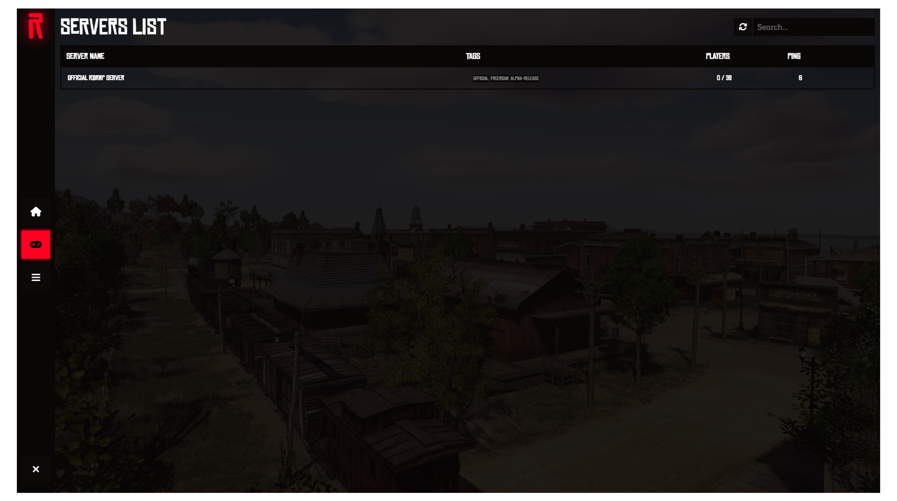
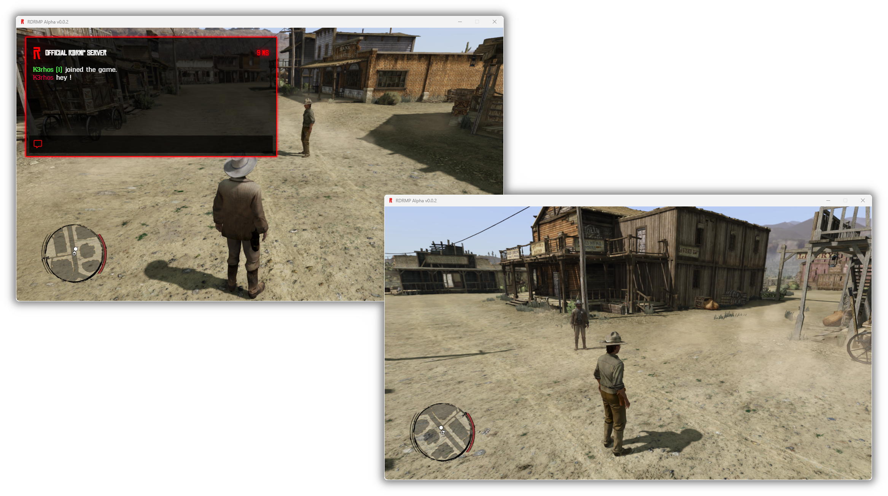

# RDRMP Documentation

**RDRMP** is a custom multiplayer mod project for Red Dead Redemption PC, it aims to create something similar to other existant alternative made for GTA titles (Like MTA or FiveM).

In this docs you will find LUA scripting functions API aswell as other documentation: F.A.Q, Troubleshooting section, game reference & more.

If you want to contribute to this documentation, you can send pull requests.

## Preview

*Main menu*

*2 players connected and playing RDRMP*
