# 🌦️ Weathers

List of all available weathers with preview picture.

## Known Natives that use this enum

| Native | Hash |
| :------------ | :------------: |
| natives.weather.set_weather | 0x456D7F38 |
| natives.weather.get_weather | 0xEA026ED9 |

## Weathers List

| Name | Id | Preview |
| :----------- | :------: | :------: |
| CLEAR | 0 | 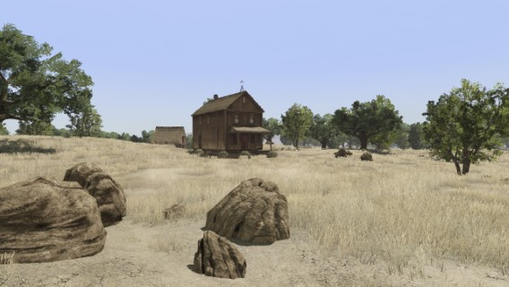 |
| FAIR | 1 | 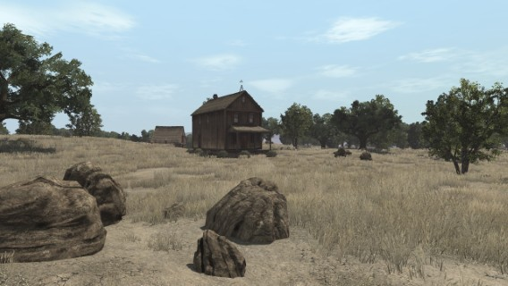 |
| CLOUDY | 2 | 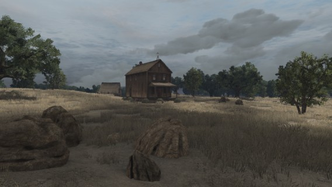 |
| RAINY | 3 | 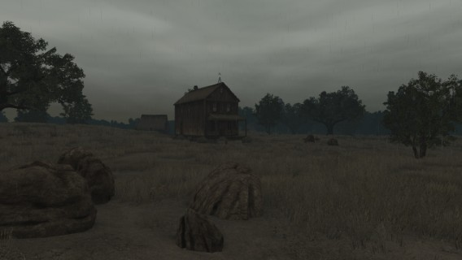 |
| STORMY | 4 | 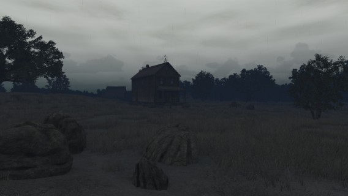 |
| SNOWY | 5 | 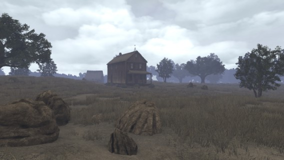 |
| INTERIOR_CLEAR | 6 |  |
| INTERIOR_FAIR | 7 |  |
| INTERIOR_CLOUDY | 8 | 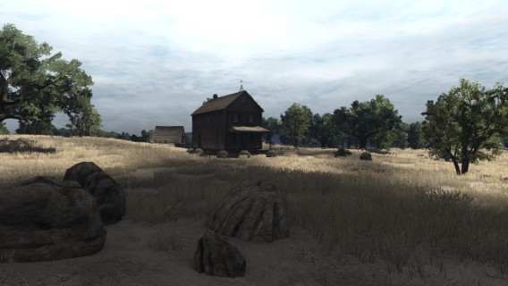 |
| INTERIOR_RAINY | 9 | 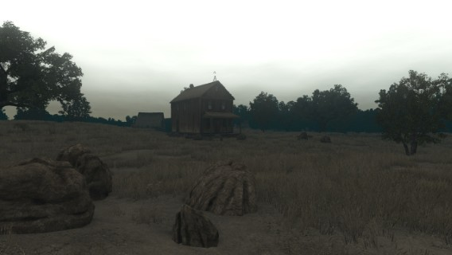 |
| INTERIOR_STORMY | 10 | 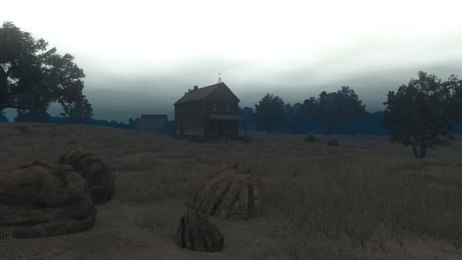 |
| INTERIOR_SNOWY | 11 |  |
| CAVE | 12 | 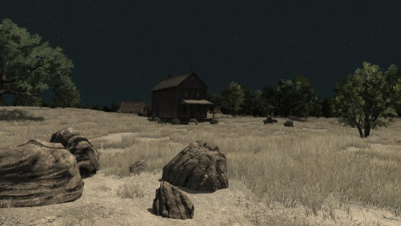 |
| THIEVES | 13 | 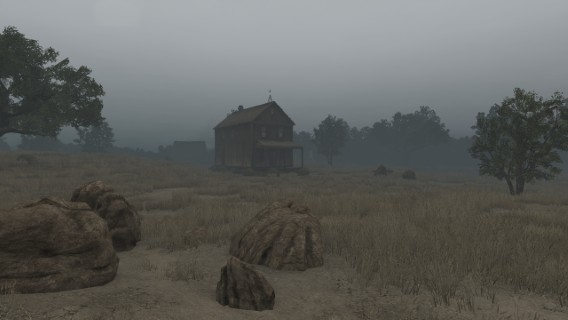 |
| FOREST | 14 |  |
| LOCATION_A | 15 | 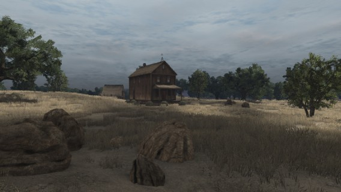 |
| LOCATION_B | 16 |  |
| LOCATION_C | 17 |  |
| INTERIOR_THIEVES | 18 | 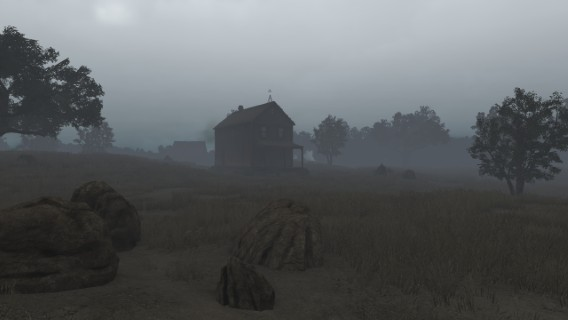 |
| INTERIOR_FOREST | 19 | 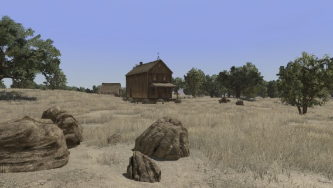 |
| INTERIOR_LOCATION_A | 20 | 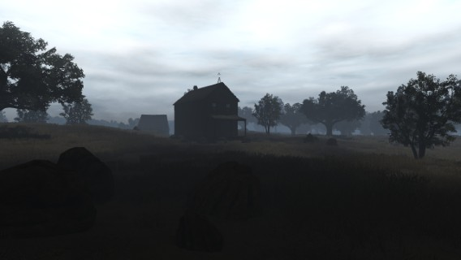 |
| INTERIOR_LOCATION_B | 21 | 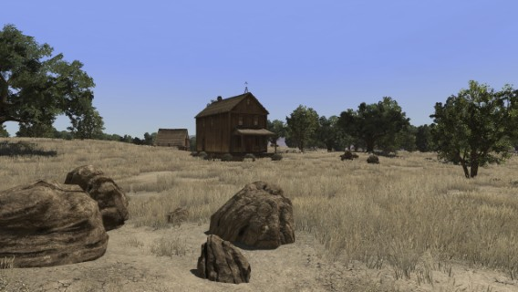 |
| INTERIOR_LOCATION_C | 22 |  |

## Snippet

```lua
WEATHER =
{
    CLEAR = 0,
    FAIR = 1,
    CLOUDY = 2,
    RAINY = 3,
    STORMY = 4,
    SNOWY = 5,
    INTERIOR_CLEAR = 6,
    INTERIOR_FAIR = 7,
    INTERIOR_CLOUDY = 8,
    INTERIOR_RAINY = 9,
    INTERIOR_STORMY = 10,
    INTERIOR_SNOWY = 11,
    CAVE = 12,
    THIEVES = 13,
    FOREST = 14,
    LOCATION_A = 15,
    LOCATION_B = 16,
    LOCATION_C = 17,
    INTERIOR_THIEVES = 18,
    INTERIOR_FOREST = 19,
    INTERIOR_LOCATION_A = 20,
    INTERIOR_LOCATION_B = 21,
    INTERIOR_LOCATION_C = 22
}
```