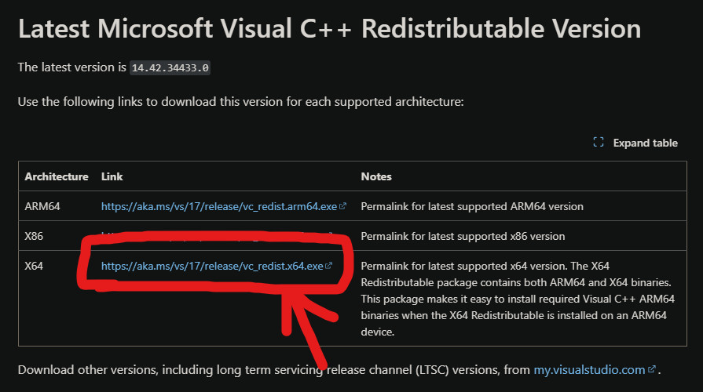

# 🧰 Troubleshooting

Below you will find a list of the common issues you can encounter when installing or using **RDRMP**.

## I'm getting _"Access Violation"_ error at game launch

If you experience access violation errors, please disable software that may conflict with **RDRMP**, such as **MSI Afterburner** and **RivaTuner**.

Additionally there is a rare bug right now where RDRMP can crash at game startup, just try again and you should be good to go. We've put this issue in a corner right now, since it's a really rare occurance.

## RDRMP not even loading

Be sure you have installed the latest [Visual C++ Redistributable](https://learn.microsoft.com/en-us/cpp/windows/latest-supported-vc-redist?view=msvc-160) from **Microsoft**. Choose the **x64** version.

## RDRMP is detected as a virus

Some antivirus software may flag the installation setup or the launcher as a potential virus, this is ofc a false positive. If you encounter this issue, please add an exclusion to your **RDRMP install folder** in your antivirus settings. Alternatively, temporarily disable your antivirus software.

> [!NOTE]
> RDRMP install folder can be found here: `%LocalAppData%/RDRMP/`
